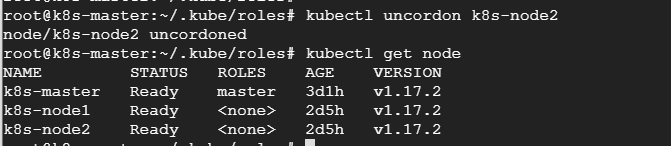

### Kubernetes Cluster Administration

#### Nodes Maintenance
You could isolate a problematic node for further troubleshooting by cordonning it off. You could also drain it while preparing for maintenance.

### Cordon a Node
```
kubectl get pods -o wide
kubectl cordon node4
node/node4 cordoned
```

### Drain a Node
```
kubectl drain k8s-node2
```
```
kubectl get node
```


### Uncordon a Node
```
kubectl uncordon k8s-node2
node/k8s-node2 uncordoned
```



