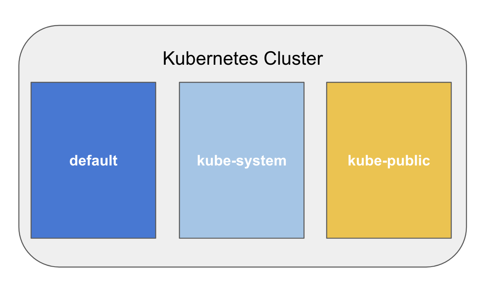
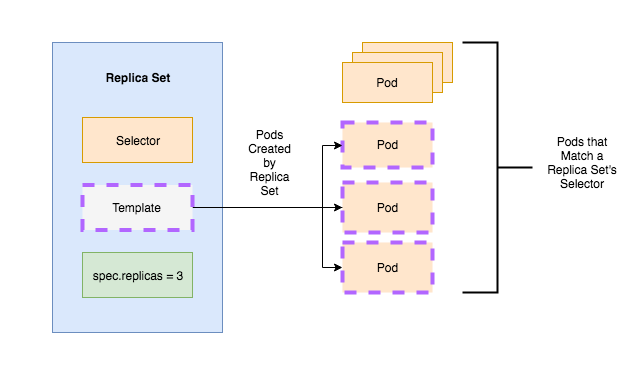
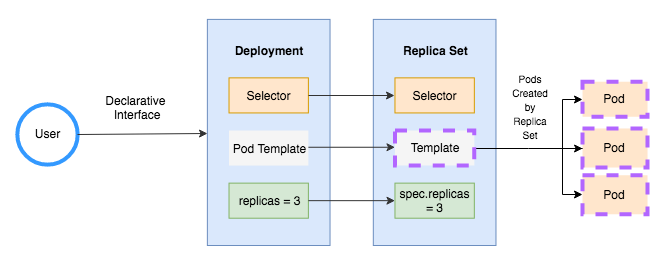

### Key Concepts of Kubernetes
In this lession we are going to learn about:
- Kubernetes Architecture
- Namespaces
- Pods
- Replica Sets and Deployments
- Service Discovery and Load Balancing
- Configmaps, Storage, Network, RBAC
- Statefulsets, Crons and Jobs


### Kubernetes Architecture


### Namespaces
Namespaces are Kubernetes objects which partition a single Kubernetes cluster into multiple virtual clusters. Each Kubernetes namespace provides the scope for Kubernetes Names it contains; which means that using the combination of an object name and a Namespace, each object gets an unique identity across the cluster.

By default, a Kubernetes cluster is created with the following three namespaces:

- default: By default all the resource created in Kubernetes cluster are created in the default namespace. By default the default namespace can allow applications to run with unbounded CPU and memory requests/limits (Until someone set resource quota for the default namespace).

- kube-public: Namespace for resources that are publicly readable by all users. This namespace is generally reserved for cluster usage.

- kube-system: It is the Namespace for objects created by Kubernetes systems/control plane.



### Pod
While Kubernetes is considered a container orchestration platform, its true building block is the Pod. According to the Kubernetes documentation “Pods are the smallest deployable units of computing that can be created and managed in Kubernetes”.

What exactly is a pod? Essentially, a pod is a layer of encapsulation for a set containers that are typically co-located together from an application perspective. For example, consider a Spring boot application running inside a container that is coupled with a nginx container as a network proxy. When scaling instances of our Spring Boot container, we would also like to scale instances of our nginx containers as well. Pods provide us this functionality.

Kubernetes Pods also utilize useful and interesting methods of container networking. One such method is ensuring that all containers in a pod operate on the same “network stack”. This implementation, conveniently, enables containers in a pod to communicate over localhost.


### Replica Sets and Deployments
* What are Replica Sets?

    We have already learned that one of the key advantages of Pods is that they allow developers/administrator to group sets of containers as an application unit and easily begin orchestrating them as workloads. Following the creation of a pod’s template, instances of this pod can then be scaled horizontally to make a Developer’s multi container applications more highly available. To manage the scaling of pods, Kubernetes uses an API object called a **ReplicaSet**.

    According to the [Kubernetes Documentation](https://kubernetes.io/docs/concepts/workloads/controllers/replicaset/), Replica Sets ensure "that a specified number of pod replicas are running at any given time." As a side note, the documentation extensively focuses on pointing out that ReplicaSets

    A ReplicaSet is considered to be a type of Kubernetes API Object. Therefore, just like any other member of this family, ReplicaSets require values for the fields of apiVersion, kind, and metadata to uniquely identify a type of API object across Kubernetes versions.

    A ReplicaSet also has an additional field that needs to be set. This is the spec.template, which is a template for a Kubernetes Pod without the apiVersion and kind, which are already present in the ReplicaSet. The Replica Set then uses this template, to create pods which it manages.

    

    ReplicaSets are rarely used independently to to manage pods. Instead, the most popular choice is to use layers of encapsulation that makes use of ReplicaSets in the form of Workload API objects. The type of Workload API object we will be focusing on is the Deployment.

* So, why do we need Deployments?

    Deployments encapsulate replica sets and pods in the Kubernetes’ resource hierarchy and provide a declarative method of updating the state of both. One method of accessing this declarative interface is through kubectl.

    Just like ReplicaSets, Deployments are Kubernetes API Objects and require the apiVersion, kind, and metadata. The Kubernetes Documentation provides an example [ngnix-deployment.yaml](https://kubernetes.io/docs/concepts/workloads/controllers/deployment/), which is a great example to demonstrate the basic functionality of Deployments.

    


### Load Balancing and Service Discovery
In this alb you are going to learn how Loadbalancing work and how service discovery work which is an Internal features offered by Kubernetes.


### Publishing external facing app with NodePort
In Kubernetes you can find 4 types of services which are

  * ClusterIP
  * NodePort
  * LoadBalancer
  * ExternalName
  
  We are going to create a Service with NodePort by which we weill be accessing our vote application
  
  File: vote-svc.yaml
  
```yaml
apiVersion: v1
kind: Service
metadata:
  name: vote
  labels:
    role: vote
spec:
  selector:
    role: vote
  ports:
    - port: 80
      targetPort: 80
      nodePort: 30000
  type: NodePort
```
  
  To crea a service with above file use the below command
  
  ```
kubectl apply -f vote-svc.yaml
kubectl get svc
kubectl describe service vote
```

**Note: You can access your vote application with NotePort 3000**

### To view the network packet routing execute the below command,
```
iptables -nvL -t nat  
iptables -nvL -t nat  | grep 30000
```
Any network trafic that comes to port 30000 get forwarded to the service

```
iptables -nvL -t nat  | grep SERVICE-NAME  -A 5
```

### Accessing Application with ExternalIP
```
kubectl  get svc

kubectl edit svc vote
```
```yaml
apiVersion: v1
kind: Service
metadata:
  name: vote
  labels:
    role: vote
spec:
  selector:
    role: vote
  ports:
    - port: 80
      targetPort: 80
      nodePort: 30000
  type: NodePort
  externalIPs:
    - xx.xx.xx.xx
    - yy.yy.yy.yy
```
**Note: replace xx.xx.xx.xx and yy.yy.yy.yy IP addresses of the nodes on two of the kubernetes hosts.

```
kubectl  get svc
kubectl apply -f vote-svc.yaml
kubectl  get svc
kubectl describe svc vote
```

### Internal Service Discovery
To understand Internal Service Discovery browse the vote application and try to click on any one option, is it working? 
To check why the application is not working follow the below steps

```
kubectl get pod
kubectl exec VOTE-POD-NAME nslookup redis
```
To resolve this let's create a service for redis

```
kubectl apply -f redis-svc.yaml

kubectl get svc

kubectl describe svc redis
```

### Creating Endpoints for Redis
Service is been created, but you still need to launch the actual pods running redis application

```
kubectl apply -f redis-deploy.yaml
kubectl describe svc redis
```
### Configmaps, Storage, Network, RBAC
### Statefulsets, Crons and Jobs

