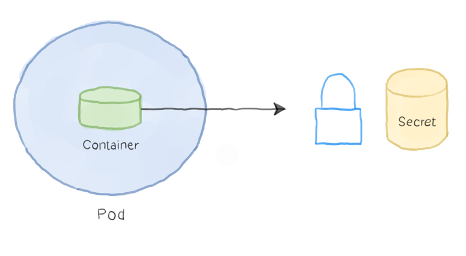

In this session we are going to learn about: 

- Introduction to ConfigMaps and Secrets
- Creating Config Map for Vote app
- Setting up Environment Specific Configs
- Adding Configs from Files
- Creating Secrets to Encrypt Database
- Setting Environment vars using Secrets

### Introduction to ConfigMaps and Secrets
*ConfigMaps*

ConfigMaps are Kubernetes objects that can draw configuration information from other sources such as directories or files. ConfigMaps are added to virtual directories called Volumes, which are mounted filesystems that share the lifetime of a Pod which encloses it. This enables containers to access information in ConfigMaps as if it were on a filesystem.

A powerful feature of ConfigMaps, is he ability to aggregate a variety of information from different file types into a config map. Furthermore, if we would like to update any of these files while our Pods are running, we can do so and have the changes be made available in realtime.

Benefits:
- Decouples configuration form pods and components.
- Store configuration data as key-value pairs 
**Note: You must create a ConfigMaps before referencing it in a Pod spec.**

*Creating ConfigMaps from:*
- Directories
- Files
- Literal Values

__file: vote-cm.yaml__

```yml
apiVersion: v1
kind: ConfigMap
metadata:
  name: vote
  namespace: operation
data:
  OPTION_A: Visa
  OPTION_B: Mastercard
```
*To Create ConfigMap Object*

```
kubectl get cm
kubectl apply -f vote-cm.yaml
kubectl get cm
kubectl describe cm vote
```

**Note Inorder to use the configmap in your deployment you need to refer the configmap form the file.**

__file: vote-deploy.yaml__

```yml
spec:
      containers:
      - image: c4clouds/vote:v1
        imagePullPolicy: Always
        name: vote
        envFrom:
          - configMapRef:
              name: vote
        ports:
        - containerPort: 80
          protocol: TCP
        restartPolicy: Always
```

*To apply*
```
kubectl apply -f vote-deploy.yaml
```
```yml
apiVersion: apps/v1
kind: Deployment
metadata:
  name: vote
spec:
  strategy:
    type: RollingUpdate
    rollingUpdate:
      maxSurge: 2
      maxUnavailable: 1
  revisionHistoryLimit: 4
  paused: false
  replicas: 6
  minReadySeconds: 20
  selector:
    matchLabels:
      role: vote
    matchExpressions:
      - {key: version, operator: In, values: [v1, v2, v3]}
  template:
    metadata:
      name: vote
      labels:
        app: python
        role: vote
        version: v1
    spec:
      containers:
        - name: app
          image: c4clouds/vote:v4
          #Config Maps goes here
          envFrom:
            - configMapRef:
                name: vote
          resources:
            limits:
              cpu: "200m"
              memory: "250Mi"
            requests: 
              cpu: "100m"
              memory: "50Mi"
          ports:
            - containerPort: 80
              protocol: TCP
```
### Setting up Environment Specific Configs
for setting up environemt specific configs create a new **NameSpace** and modify the files available on kuberetes-lab/voting-app-lab
provide namespace to the spec files.

### Adding Configs from Files

__file: redis.conf__

```r
bind 0.0.0.0
protected-mode yes
port 6379
tcp-backlog 511
timeout 0
tcp-keepalive 300
daemonize no
supervised no
pidfile /var/run/redis_6379.pid
loglevel notice
logfile ""
databases 16
always-show-logo yes
save 900 1
save 300 10
save 60 10000
stop-writes-on-bgsave-error yes
rdbcompression yes
rdbchecksum yes
```

*To Apply*
```
kubectl create configmap --from-file redis.conf redis
```
__file: redis-deployment-with-configmap.yml__

```yml
apiVersion: apps/v1
kind: Deployment
metadata:
  name: redis
  #namespace: operation
spec:
  replicas: 2
  selector:
    matchLabels:
      tier: back
      role: redis
  minReadySeconds: 10
  template:
    metadata:
      labels:
        app: redis
        role: redis
        tier: back
        version: latest
    spec:
      containers:
      - image: c4clouds/redis:latest
        imagePullPolicy: Always
        name: redis
        ports:
        - containerPort: 6379
          protocol: TCP
        volumeMounts: #Mounting configmaps as a volume inside pod 
          - name: redis
            subPath: redis.conf
            mountPath: /etc/redis.conf
      restartPolicy: Always
      volumes: # specifying configmap as a volume 
        - name: redis
          configMap:
            name: redis
```            

*To check*
```
kubectl exec redis-7bb9c48c7f-dcwfw -- /bin/bash -c 'cat /etc/redis.conf'
```
**Provide your redis pod name**

### Creating Secrets to Encrypt Database
Secrets, in Kubernetes are a lot like ConfigMaps, except they encode information for safekeeping of sensitive information. This is essential for data such as API Keys, certificates, and many others.

As depicted in the following image, the container accesses the secret through a volume in pretty much the same way as it does with configMap volumes:



*Create secret for Postgresql database*
__file: db-secret.yml__

```yml
apiVersion: v1
kind: Secret
metadata:
  name: db
  #namespace:
type: Opaque
data:
  # provide base64 encoded username/password (root/password)
  POSTGRES_USER: YWRtaW4K
  POSTGRES_PASSWORD: cGFzc3dvcmQK
```

*To apply*
```
kubectl apply -f db-secret.yml
```
*Create db-deployment-with-secret*

__file: db-deployment-with-secret.yml__

```yml
apiVersion: apps/v1
kind: Deployment
metadata:
  name: db
  #namespace: operation
spec:
  replicas: 1
  selector:
    matchLabels:
      tier: back
      app: postgres
  minReadySeconds: 10
  template:
    metadata:
      labels:
        app: postgres
        role: db
        tier: back
    spec:
      containers:
      - image: postgres
        imagePullPolicy: Always
        name: db
        env:
          - name: POSTGRES_USER
            valueFrom:
              secretKeyRef:
                name: db
                key: POSTGRES_USER

          - name: POSTGRES_PASSWORD
            valueFrom:
              secretKeyRef:
                name: db
                key: POSTGRES_PASSWORD
        ports:
        - containerPort: 5432
          protocol: TCP
```

