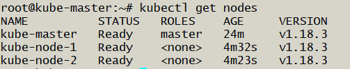
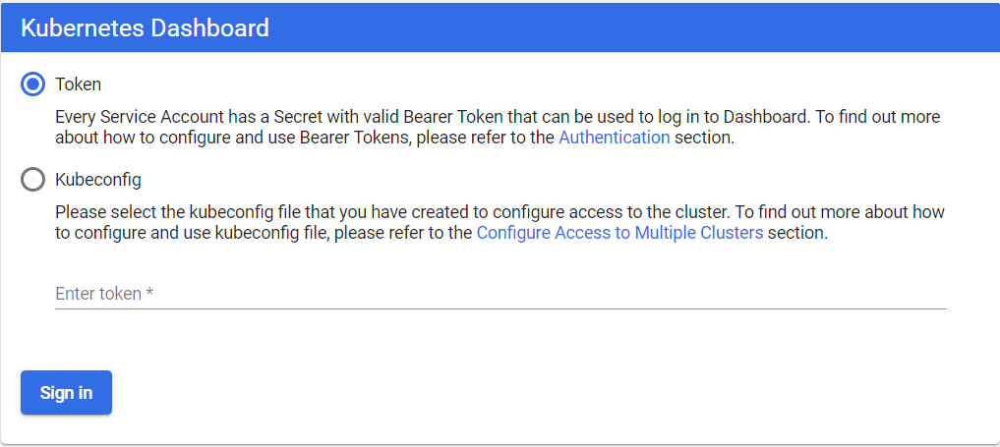
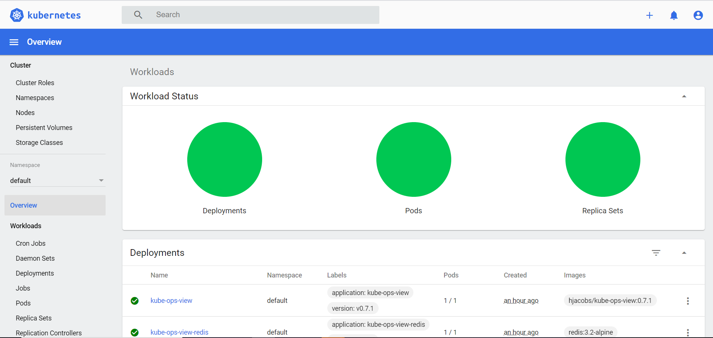

In this lession we are going to learn about:

- Provisioning and configuring on AWS/GCP
- Initialise Cluster with Kubeadm
- Setting up Calico CNI
- Launching Kubernetes Dashboard
- Setting up a kubernetes Visualizer
- Resetting cluster created with kubeadm

### Provisioning and configuring on AWS/GCP
Create three VM's on AWS or GCP Cloud Platform.

1 Master Node and 2 Worker Nodes.

#### Initialise Cluster with Kubeadm
__Master node must be configured with 2 CPU and 2GB of RAM__
### Installing Kubernetes on Ubuntu

#Update 
```
sudo apt-get update

``` 
### Downloading the gpg
```
curl -s https://packages.cloud.google.com/apt/doc/apt-key.gpg | sudo apt-key add -
```
### Installing Docker and Kubernetes packages
```syntax
sudo apt-add-repository "deb http://apt.kubernetes.io/ kubernetes-xenial main"
sudo apt-get update
sudo apt-get install -y docker.io kubelet kubeadm kubectl kubernetes-cni 

```
### turning off swap
```
sudo swapoff -a

```

### Initializing Master
```
  sudo kubeadm init --apiserver-advertise-address **PROVIDE IP ADDRESS HERE** --pod-network-cidr=192.168.0.0/16
```
attach initializing-master image

### Initialization of the Nodes
After master being initialized, it should display the command which could be used on all worker/nodes to join the k8s cluster.
```
sudo kubeadm join 10.128.0.2:6443 --token m7qgmb.6gjki057ajpo49nq \
    --discovery-token-ca-cert-hash sha256:fc5d3ec0fe14b141cf87baa206082cf3a26b8c158c02e255f232e1768905b8b7
```
Note: Don't copy and paste the above command, use the output which you have received at the master initialization

### Settingup the Kubectl client configureation On Master node
```color
mkdir -p $HOME/.kube
sudo cp -i /etc/kubernetes/admin.conf $HOME/.kube/config
sudo chown $(id -u):$(id -g) $HOME/.kube/config
```

### To Validate the Cluster Setup
```
sudo kubectl get nodes
```
add picture "kubectl-get-nodes"

If you see the above image you can find both the worker nodes are in NotReady state. It means Master node is unable to communicat to the worker node(s). In order make the communication we have to install the netwrok driver. we are going to install Weave

### Installing Calico CNI
```
kubectl apply -f https://docs.projectcalico.org/manifests/calico.yaml
```


### Launching Kubernetes Dashboard
```yml
wget https://raw.githubusercontent.com/kubernetes/dashboard/v2.0.0/aio/deploy/recommended.yaml

#Open the file and update the service to
ports:
  - nodePort: 32414
    port: 443
    targetPort: 8443
type: NodePort

#To apply 
kubectl apply -f recommended.yaml
```

### Creating a Service Account
We are creating Service Account with name admin-user in namespace kubernetes-dashboard first.
```
cat <<EOF | kubectl apply -f -
apiVersion: v1
kind: ServiceAccount
metadata:
  name: admin-user
  namespace: kubernetes-dashboard
EOF
```

### Creating a ClusterRoleBinding
the ClusterRole cluster-admin already exists in the cluster. We can use it and create only ClusterRoleBinding for our ServiceAccount. If it does not exist then you need to create this role first and grant required privileges manually.
```
cat <<EOF | kubectl apply -f -
apiVersion: rbac.authorization.k8s.io/v1
kind: ClusterRoleBinding
metadata:
  name: admin-user
roleRef:
  apiGroup: rbac.authorization.k8s.io
  kind: ClusterRole
  name: cluster-admin
subjects:
- kind: ServiceAccount
  name: admin-user
  namespace: kubernetes-dashboard
EOF
```

In order to access the Kubernetes dashboard https://Node-IP-Address:32414 

[output]



__Getting a Bearer Token__
```yml
kubectl -n kubernetes-dashboard describe secret $(kubectl -n kubernetes-dashboard get secret | grep admin-user | awk '{print $1}')
#Copy and paste the token on the dashboard browser window
```
```
kubectl -n kubernetes-dashboard create token admin-user
```



### Set up Visualiser
```
git clone https://github.com/submah/kubernetes.git
kubectl apply -f kubernetes/kubernetes-ops-view/deploy
```
[Output]
```
serviceaccount/kube-ops-view created
clusterrole.rbac.authorization.k8s.io/kube-ops-view created
clusterrolebinding.rbac.authorization.k8s.io/kube-ops-view created
deployment.apps/kube-ops-view created
ingress.extensions/kube-ops-view created
deployment.apps/kube-ops-view-redis created
service/kube-ops-view-redis created
service/kube-ops-view created
```

Visualiser is accessable over a service port whic we can get it for below command

```
kubectl get svc | grep -i kube-ops-view
```

```
http://<NODE_IP>:servie-port/#scale=2.0
```


