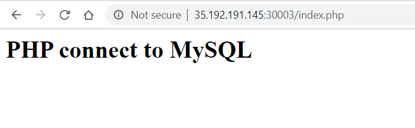

In this session we are going to learn: 
- What is NetworkPolicy
- Creating default NetworkPolicy for Namespace
- Create and apply NetworkPolicy for mysql Namespace
- Inter namesapce pods communication with NetworPolicy (web with mysql)

### What is NetworkPolicy.
Network policies are Kubernetes resources that control the traffic between pods and/or network endpoints. They uses labels to select pods and specify the traffic that is directed toward those pods using rules. Most CNI plugins support the implementation of network policies, however, if they don't and we create a NetworkPolicy, then that resource will be ignored.

The most popular CNI plugins with network policy support are:

- Weave
- Calico
- Cilium
- Kube-router
- Romana

In Kubernetes, pods are capable of communicating with each other and will accept traffic from any source, by default. With NetworkPolicy we can add traffic restrictions to any number of selected pods, while other pods in the namespace (those that go unselected) will continue to accept traffic from anywhere. The NetworkPolicy resource has mandatory fields such as apiVersion, kind, metadata and spec. Its spec field contains all those settings which define network restrictions within a given namespace:

**podSelector** selects a group of pods for which the policy applies
**policyTypes** defines the type of traffic to be restricted (inbound, outbound, both)
**ingress** includes inbound traffic whitelist rules
**egress** includes outbound traffic whitelist rules


### Creating default network policy for namespace
*Create **web** namespace*
```
mkdir {web,mysql}

cd web
```

__File: create-web-namespace.yml__

```yml
kind: Namespace
apiVersion: v1
metadata:
  name: web
  labels:
    project: web
```

__File: httpd-php-pod.yml__

```yml
apiVersion: v1
kind: Pod
metadata:
  namespace: web
  name: httpd-php
  labels:
    app: apache
    role: httpd-php 
spec:
  containers:
    - name: httpd-php
      image: c4clouds/httpd-php
      command: ["/usr/sbin/apachectl"]
      args: ["-D", "FOREGROUND"]
      ports:
        - containerPort: 80
          protocol: TCP
```
**Note: In order to access the httpd-php pod we have to create one service**

__File: httpd-php-service.yml__

```yml
apiVersion: v1
kind: Service
metadata:
  namespace: web
  name: httpd-php-pod-service
  labels:
    role: apache
spec:
  selector:
    app: apache
  ports:
    - port: 80
      targetPort: 80
      nodePort: 30003
  type: NodePort
```


*Create **mysql** namespace*

```bash
cd mysql
```
__File: create-mysql-namespace.yml__

```yml
kind: Namespace
apiVersion: v1
metadata:
  name: mysql
  labels:
    project: mysql
```

__File: mysql-pod.yml__

```yml
apiVersion: v1
kind: Pod
metadata:
  namespace: mysql
  name: mysql-pod
  labels:
    app: mysql
spec:
  containers:
    - name: mysql-pod
      image: mysql:5.6
      env:
          # Use secret in real usage
        - name: MYSQL_ROOT_PASSWORD
          value: root
      ports:
        - containerPort: 3306
```
*Create a service for mysql*

__File: mysql-service.yml__

```yml
apiVersion: v1
kind: Service
metadata:
  namespace: mysql
  name: mysql-pod-service
  labels:
    app: mysql
spec:
  selector:
    role: mysql
  ports:
    - port: 3306
      targetPort: 3306
```

**Note: Now if you access the *httpd-php* web application with Node *Public-IP:30003* you can see httpd-php is able to connect**

[Output]



## Without NetworkPolicy all pods can communicate to other pods.


